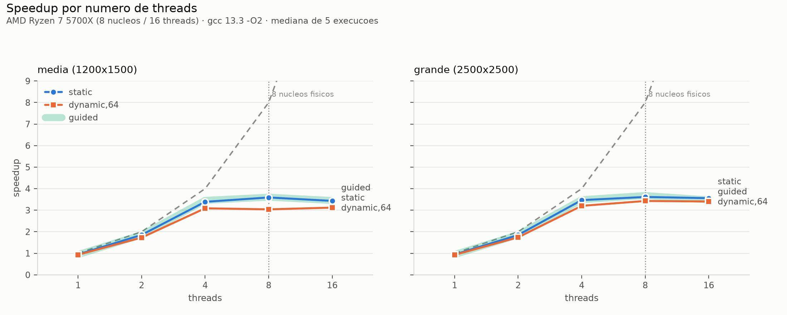
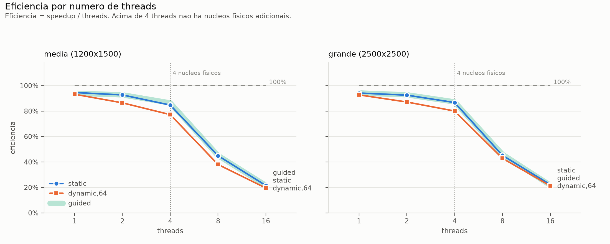

# 1. Introdução

Este trabalho implementa a simulação da propagação de incêndio em uma área florestal
representada por uma matriz de `L * C` células, sob influência de vento direcional e de zonas
de contenção ativadas em passos pré-determinados. Foram desenvolvidas duas versões: uma
sequencial (`fire_seq.c`) e uma paralela em OpenMP (`fire_omp.c`).

O modelo é um autômato celular determinístico. O estado de cada célula no passo `p+1` depende
apenas do estado da vizinhança de Moore no passo `p`, e é essa propriedade que sustenta toda a
estratégia de paralelização descrita adiante.

# 2. Solução sequencial

## 2.1 Estruturas de dados

A área é representada por vetores lineares de `L * C` posições, indexados por
`indice = linha * C + coluna`. São mantidos:

- `cobertura[]` e `umidade[]`, constantes durante toda a simulação;
- `estado_atual[]` e `proximo_estado[]`, o duplo buffer de estados;
- `tempo_atual[]` e `proximo_tempo[]`, o duplo buffer de tempo de queima;
- `ativacao[]`, com o passo de ativação da zona de contenção ou `-1`.

Usamos vetores separados em vez de um vetor de `struct` porque assim cada campo é percorrido de
forma contígua, o que ajuda a vetorização do laço interno.

## 2.2 Preparação

1. Leitura e validação da entrada, cobrindo as restrições da seção 5 do enunciado.
2. Geração da cobertura e da umidade, percorrendo a matriz em ordem linear crescente. Para cada
   célula gera-se primeiro `rand_r(&seed) % 100` (cobertura) e logo em seguida
   `rand_r(&seed) % 101` (umidade). Essa ordem é obrigatória, porque qualquer alteração produz
   uma floresta diferente.
3. Aplicação dos focos iniciais, com tempo de queima 2 para vegetação rasteira e 4 para floresta.
4. Construção do mapa de ativação, guardando o menor passo de ativação quando há zonas
   sobrepostas.

Nenhuma dessas etapas entra no trecho cronometrado.

## 2.3 Laço de simulação

Cada passo `p` executa, nesta ordem:

1. ativação das zonas programadas para `p` (apenas células intactas tornam-se contenção);
2. cálculo de `proximo_estado`/`proximo_tempo` a partir de `estado_atual`/`tempo_atual`;
3. acumulação das estatísticas do passo (novas ignições, células em chamas);
4. troca dos buffers por permuta de ponteiros;
5. verificação da condição de parada.

O potencial de ignição de uma célula intacta é calculado sobre os oito vizinhos de Moore,
considerando apenas os que estão em chamas, com peso básico 10 (ortogonal) ou 7 (diagonal),
ajustado pelo alinhamento com o vento `A = prop_linha * vento_linha + prop_coluna * vento_coluna`
e pela intensidade `V`, resultando em `Pv = max(1, P_basico + V * A)`. Toda a aritmética é
inteira, conforme exigido.

A troca dos buffers é feita por permuta de ponteiros em vez de cópia, o que evita `2 * L * C`
escritas a cada passo.

# 3. Solução paralela

## 3.1 Estratégia

A decisão central foi usar uma única região paralela persistente, que engloba todo o laço de
passos:

```c
#pragma omp parallel num_threads(T) default(none) shared(...)
{
    for (int p = 0; p < P && continuar; p++)
    {
        #pragma omp for schedule(runtime)      /* ativação das zonas  */
        #pragma omp single                     /* zera acumuladores   */
        #pragma omp for schedule(runtime) reduction(+:...)  /* atualização */
        #pragma omp single                     /* estatísticas, troca, parada */
    }
}
```

A alternativa mais imediata seria abrir um `#pragma omp parallel for` dentro do laço de passos.
Ela produz o mesmo resultado, mas cria e destrói a equipe de threads uma vez por passo, o que
com `P = 100` significa 100 criações desnecessárias.

Todas as threads percorrem o laço de passos. O que se repete `T` vezes é apenas o controle do
laço, ou seja, o incremento e o teste da condição, cujo custo é desprezível. O trabalho efetivo
fica a cargo dos `omp for`.

## 3.2 Ausência de condições de corrida

O duplo buffer elimina a dependência entre células dentro de um mesmo passo. Todas as leituras
ocorrem em `estado_atual` e `tempo_atual`, e todas as escritas em `proximo_estado` e
`proximo_tempo`, sempre na posição da própria célula. Nenhuma célula é escrita por mais de uma
thread.

As barreiras implícitas garantem a ordem entre as fases:

- ao final do `omp for` de ativação das zonas, nenhuma thread inicia a atualização enquanto
  outra ainda modifica `estado_atual`;
- ao final do `omp for` de atualização, as reduções já estão consolidadas quando o `single`
  seguinte é executado;
- ao final do `single`, a troca dos ponteiros e o novo valor de `continuar` são visíveis a
  todas as threads antes do teste da condição do laço.

Não usamos `critical` nem `atomic` dentro do laço principal. Os contadores de novas ignições e
de células em chamas vêm de `reduction(+:...)`, e a parte serial (acumulação global, pico de
ignições, permuta de ponteiros e condição de parada) fica em `omp single`, cuja barreira
implícita dispensa qualquer sincronização explícita.

## 3.3 Vetorização

O laço de atualização tem dois níveis. O `omp for` distribui as linhas entre as threads e o
`omp simd` percorre as colunas dentro de cada linha, com reduções locais que são somadas aos
acumuladores da thread ao final da linha. Como o percurso por colunas é contíguo em memória,
ele favorece tanto a vetorização quanto a localidade de cache.

## 3.4 Condição de parada

A condição de parada reaproveita o contador `chamas_proximo`, que já vem da redução feita
durante o cálculo do próximo estado. Assim não é preciso varrer a matriz uma segunda vez só
para saber se ainda existe fogo.

Antes de criar a região paralela há uma verificação adicional: se não houver nenhuma célula em
chamas após a aplicação dos focos iniciais, nenhum passo é executado, conforme a seção 9 do
enunciado.

## 3.5 Escalonamento

Ambos os `omp for` usam `schedule(runtime)`, permitindo comparar políticas de escalonamento por
variável de ambiente sem recompilar:

```
OMP_SCHEDULE="dynamic,64" ./fire_omp entrada.txt
```

Quando `OMP_SCHEDULE` não é definida, o programa fixa `static` como padrão via
`omp_set_schedule()`. A justificativa dessa escolha está na seção 7.2.

# 4. Validação

A especificação exige que as versões sequencial e paralela produzam valores idênticos em todos
os campos, exceto o tempo. Foram verificados três níveis de equivalência.

**4.1 Sequencial contra paralela.** Nas três cargas fornecidas as duas versões produzem saída
idêntica, incluindo o `checksum`:

| Carga | Dimensões | checksum |
|-------|-----------|----------|
| pequena | 400 × 500 | 17073017104646724864 |
| média | 1200 × 1500 | 17187382406529706254 |
| grande | 2500 × 2500 | 14825089465781038537 |

**4.2 Independência do número de threads e do escalonamento.** A versão paralela foi executada
com 1, 2, 4, 8 e 16 threads, sob os escalonamentos `static`, `dynamic,64` e `guided`. Todas as
combinações produziram saída idêntica, o que confirma que não há condição de corrida nem
dependência da ordem de execução.

**4.3 Casos de validação de entrada.** O diretório `tests/` contém casos que exercitam as
restrições da seção 5: foco fora da matriz, zona fora da matriz, passo de ativação inválido,
zonas sobrepostas e estouro dos parâmetros da primeira linha. O alvo `make test` executa as duas
versões sobre todas as entradas e compara as saídas ignorando a linha de tempo.

# 5. Ambiente experimental

As medições foram feitas no nó `hal01` do cluster do LASDPC, acessado por SSH.

| Item | Configuração |
|------|--------------|
| Nó | `hal01` (andromeda.lasdpc.icmc.usp.br) |
| Processador | Intel Core i7-4790 @ 3,60 GHz |
| Núcleos | 4 físicos / 8 lógicos (SMT2) |
| Cache L3 | 8 MiB |
| Nós NUMA | 1 |
| Memória | 31 GiB |
| Sistema | Ubuntu 24.04.4 LTS, kernel 5.15.75 |
| Compilador | gcc 5.3.1 |
| Flags | `-std=c99 -fopenmp -O2` (idênticas nas duas versões) |
| Medição | `omp_get_wtime()` sobre o núcleo da simulação |
| Metodologia | 5 execuções por configuração; valor reportado é a mediana |

Duas características do nó orientam a leitura dos resultados. A primeira é que os 8 contextos de
execução correspondem a apenas 4 núcleos físicos, de modo que a partir de 4 threads não há
unidades de execução novas, apenas compartilhamento SMT. A segunda é que a grade de medição vai
até 16 threads, o dobro dos contextos disponíveis; esse último ponto foi mantido justamente para
mostrar onde o ganho cessa.

O compilador disponível no nó é o gcc 5.3.1, que implementa OpenMP 4.0. Essa versão não aceita
variável qualificada com `const` na lista de compartilhamento de uma região `default(none)`, o
que exigiu remover o qualificador de `total_celulas` em `fire_omp.c`. A alteração não muda o
comportamento do programa.

# 6. Resultados

Todas as medições seguem a metodologia da seção 5. Os dados brutos estão em `bench/raw.csv` e
as tabelas completas em `bench/resultados.md`, reprodutíveis com `bash bench/run.sh`.

## 6.1 Determinismo

A equivalência entre as versões foi verificada sobre as 255 execuções da bateria, cobrindo
1, 2, 4, 8 e 16 threads e os escalonamentos `static`, `dynamic,64`, `guided` e `dynamic,1`:

| Carga | Execuções | Checksums distintos |
|---|---|---|
| pequena | 80 | 1 |
| média | 80 | 1 |
| grande | 95 | 1 |

Ter um único checksum por carga em todas as execuções confirma que o resultado não depende do
número de threads nem da política de escalonamento.

## 6.2 Tempos e speedup

Baseline sequencial (mediana de 5 execuções): pequena 0,2415 s; média 2,8141 s; grande 9,8161 s.

**Carga grande (2500 x 2500), sequencial = 9,8161 s**

| T | static (s) | speedup | guided (s) | speedup | dynamic,64 (s) | speedup |
|---|---|---|---|---|---|---|
| 1 | 10,4222 | 0,94 | 10,4182 | 0,94 | 10,5852 | 0,93 |
| 2 | 5,3043 | 1,85 | 5,2894 | 1,86 | 5,6325 | 1,74 |
| 4 | 2,8299 | 3,47 | 2,8134 | 3,49 | 3,0656 | 3,20 |
| 8 | 2,7152 | 3,62 | 2,6671 | 3,68 | 2,8631 | 3,43 |
| 16 | 2,7582 | 3,56 | 2,8218 | 3,48 | 2,8823 | 3,41 |

**Carga média (1200 x 1500), sequencial = 2,8141 s**

| T | static (s) | speedup | guided (s) | speedup | dynamic,64 (s) | speedup |
|---|---|---|---|---|---|---|
| 1 | 2,9748 | 0,95 | 2,9931 | 0,94 | 3,0187 | 0,93 |
| 2 | 1,5181 | 1,85 | 1,5170 | 1,86 | 1,6271 | 1,73 |
| 4 | 0,8303 | 3,39 | 0,8142 | 3,46 | 0,9112 | 3,09 |
| 8 | 0,7834 | 3,59 | 0,7806 | 3,61 | 0,9256 | 3,04 |
| 16 | 0,8200 | 3,43 | 0,8152 | 3,45 | 0,9018 | 3,12 |



Figura 1. Speedup em função do número de threads. A linha tracejada cinza marca o speedup linear
ideal e a pontilhada vertical marca o limite de núcleos físicos. As curvas de `static` e `guided`
são praticamente coincidentes, por isso `guided` aparece como faixa larga sob a linha de
`static`.

A carga pequena (400 x 500) ficou fora das curvas de escalabilidade. Seu tempo sequencial é de
0,24 s, de modo que as medições com 8 e 16 threads caem na faixa de 0,07 s, onde a criação da
equipe de threads e o ruído do sistema pesam mais que o trabalho útil. Ela é retomada na seção
7.6, onde interessa como terceiro ponto do eixo da carga de trabalho e não como medida precisa
de tempo.

## 6.3 Eficiência

| T | grande, static | grande, guided | grande, dynamic,64 |
|---|---|---|---|
| 1 | 94,2% | 94,2% | 92,7% |
| 2 | 92,5% | 92,8% | 87,1% |
| 4 | 86,7% | 87,2% | 80,1% |
| 8 | 45,2% | 46,0% | 42,9% |
| 16 | 22,2% | 21,7% | 21,3% |



Figura 2. Eficiência em função do número de threads.

A eficiência é calculada sobre o número de threads, mas o nó possui 4 núcleos físicos. Relativa
aos núcleos físicos, a eficiência do melhor resultado (speedup 3,68 com `guided`) é de
3,68 / 4 = 92%. O programa aproveita 92% da capacidade física disponível, e não os 46% que a
divisão por 8 sugere.

## 6.4 Escalonamento `dynamic,1`, o padrão do libgomp

| T | tempo (s) | speedup | vs `static` |
|---|---|---|---|
| 1 | 16,0849 | 0,61 | 1,54x mais lento |
| 2 | 20,1827 | 0,49 | 3,80x mais lento |
| 4 | 18,2072 | 0,54 | 6,43x mais lento |
| 8 | 16,1714 | 0,61 | 5,96x mais lento |
| 16 | 16,0566 | 0,61 | 5,82x mais lento |

### 6.5 Impacto das flags de otimização

Carga grande, 4 threads, `static`, mediana de 3 execuções, reprodutível por `bash bench/flags.sh`:

| CFLAGS | sequencial (s) | paralelo (s) | speedup |
|---|---|---|---|
| (nenhuma) | 35,183 | 9,528 | 3,69 |
| `-O2` | 9,740 | 2,882 | 3,38 |
| `-O3` | 6,085 | 2,995 | 2,03 |

## 7. Análise

### 7.1 Escalabilidade

O escalonamento é praticamente linear até 2 threads (92,5% de eficiência na carga grande), cai
para 86,7% em 4 threads e satura em um speedup de aproximadamente 3,6.

Esse teto vem da baixa intensidade aritmética do núcleo da simulação. Para atualizar uma célula
o programa lê até nove posições de `estado_atual` (a própria e os oito vizinhos de Moore), mais
`tempo_atual`, `cobertura` e `umidade`, e escreve em `proximo_estado` e `proximo_tempo`. Contra
esse volume de acessos há pouca conta a fazer: somas, comparações e uma divisão inteira. O
desempenho acaba limitado pela largura de banda de memória, e não pela capacidade de cálculo.
Como os 4 núcleos dividem o mesmo controlador de memória e os mesmos 8 MiB de L3, a banda satura
antes das unidades de execução.

A matriz da carga grande tem cerca de 6,25 milhões de células. Somando os dois buffers de estado,
os dois de tempo, a cobertura e a umidade, o conjunto de trabalho passa em várias ordens de
grandeza dos 8 MiB de L3, o que obriga tráfego contínuo com a memória principal a cada passo.

## 7.2 Efeito do SMT e do superdimensionamento

O nó tem 4 núcleos físicos e 8 contextos de execução, o que separa a grade de medição em três
regimes distintos. Até 4 threads cada uma ocupa um núcleo próprio. De 4 para 8 threads passam a
existir duas threads por núcleo, compartilhando as mesmas unidades de execução. Acima de 8 o
número de threads excede os contextos disponíveis e o sistema operacional passa a alternar entre
elas.

Da primeira transição, 4 para 8 threads, resulta um ganho modesto:

| Carga | `static` | `guided` | `dynamic,64` |
|---|---|---|---|
| média | +5,6% | +4,1% | -1,6% |
| grande | +4,1% | +5,2% | +6,6% |

As duas threads lógicas de um mesmo núcleo se revezam durante as esperas por memória e, como a
carga é limitada por banda, esse preenchimento de bolhas rende alguns pontos percentuais. O ganho
é pequeno porque não existem unidades de execução novas, apenas melhor aproveitamento das que já
havia.

A segunda transição, 8 para 16 threads, produz perda em oito das nove combinações medidas:

| Carga | `static` | `guided` | `dynamic,64` |
|---|---|---|---|
| pequena | -29,0% | -5,7% | -1,0% |
| média | -4,7% | -4,4% | +2,6% |
| grande | -1,6% | -5,8% | -0,7% |

Nesse regime não há recurso algum a ganhar: o custo de alternar entre threads que disputam o
mesmo contexto passa a ser puro desperdício. A perda é pequena nas cargas maiores, entre 1% e 6%,
e expressiva na carga pequena, onde o tempo de criação da equipe de threads representa parcela
significativa do total.

## 7.3 O custo do escalonamento dinâmico de granularidade unitária

O resultado mais chamativo do experimento é que `dynamic,1` deixa a versão paralela entre 1,6 e
2 vezes mais lenta que a sequencial em todas as contagens de threads, com speedup entre 0,49 e
0,61. Esse é justamente o escalonamento que o libgomp adota quando `OMP_SCHEDULE` não está
definida.

Dois efeitos se somam aí. O primeiro é o custo por iteração. Com uma única thread, onde não
existe disputa possível, `dynamic,1` já é 54% mais lento que `static`, 16,08 s contra 10,42 s.
Esse custo vem da mecânica do escalonamento dinâmico, em que a thread consulta um contador
compartilhado a cada iteração para saber qual é o próximo índice, em vez de percorrer um
intervalo calculado de antemão.

O segundo é a contenção. O pior tempo absoluto aparece com 2 threads, 20,18 s e speedup 0,49,
pior até que com uma thread só. Daí em diante a disputa satura e o tempo se estabiliza entre
16 s e 18 s qualquer que seja o número de threads, que é o comportamento típico de um gargalo
serializado.

O laço de ativação das zonas amplifica o problema, porque percorre todas as `L * C` células a
cada passo. Na carga grande são 6,25 milhões de aquisições do contador por passo, ou 625 milhões
ao longo da simulação, para um corpo de laço que não faz mais que duas comparações.

Foi por isso que o programa passou a definir `static` como padrão através de
`omp_set_schedule()` quando `OMP_SCHEDULE` não está presente, mantendo a possibilidade de trocar
a política por variável de ambiente durante os experimentos.

### 7.4 Comparação entre escalonamentos

`static` e `guided` são equivalentes em todas as configurações medidas e superam `dynamic,64` de
forma consistente. Em 4 threads na carga grande os tempos são 2,830 s e 2,813 s contra 3,066 s.

A explicação está na regularidade da carga de trabalho. Toda célula executa o mesmo bloco de
atualização, e apenas as intactas avaliam a vizinhança de Moore, distribuídas de maneira
razoavelmente uniforme pela matriz. Sem desbalanceamento não há o que um escalonamento dinâmico
corrija, e seu custo fica sem contrapartida. A divisão em blocos contíguos do `static` já
equilibra o trabalho e ainda preserva a localidade de cache, porque cada thread percorre linhas
vizinhas.

O `guided` chega perto do `static` porque seus primeiros blocos são grandes, o que o aproxima de
uma divisão estática quando não existe desequilíbrio a corrigir.

## 7.5 Impacto das flags de otimização

Compilar sem otimização é o que produz o maior speedup, 3,69 contra 3,38 com `-O2`. O resultado
serve de alerta contra tratar o speedup como métrica suficiente. Sem otimização o baseline
sequencial fica artificialmente lento, e a paralelização recupera de graça uma folga que o
próprio compilador eliminaria. O tempo absoluto mostra o quadro real, já que a versão paralela
sem otimização leva 9,528 s, mais que o triplo dos 2,882 s da versão com `-O2`.

O caso de `-O3` é mais instrutivo ainda. Ele reduz o tempo sequencial em 38%, de 9,740 s para
6,085 s, mas piora ligeiramente o tempo paralelo, de 2,882 s para 2,995 s. O speedup despenca
para 2,03 justamente porque o compilador otimizou melhor o código que servia de referência. Um
leitor que olhasse apenas a coluna de speedup concluiria que `-O3` prejudicou a paralelização,
quando o que houve foi melhora do denominador.

Adotou-se `-O2`, e a escolha se sustenta no dado: é a configuração que produz o menor tempo
absoluto da versão paralela no nó utilizado. Há ainda uma questão de correção, pois a
especificação pede o uso de `simd`, e sem otimização o gcc não vetoriza, o que faria a diretiva
não ter efeito nenhum no binário entregue.

## 7.6 Análise pelo modelo de desempenho

Avaliar apenas o tempo de resposta do algoritmo paralelo é insuficiente: é preciso considerar
também os custos extra da versão concorrente, o tamanho da plataforma e a carga de trabalho
(Foster, 1994). Esta seção retoma os dados sob esses três eixos.

### Speedup absoluto e relativo

O speedup absoluto toma como referência a melhor versão sequencial conhecida, enquanto o relativo
toma a própria versão paralela executada com uma thread. Reportar os dois separa o ganho de
paralelismo da diferença entre os binários discutida em 7.7:

| p | Tp (s) | Sp absoluto | Sp relativo | E relativa | e(p) | CT = p*Tp | To = CT - Tseq |
|---|---|---|---|---|---|---|---|
| 1 | 10,4222 | 0,94 | 1,00 | 100,0% | | 10,422 | +0,606 |
| 2 | 5,3043 | 1,85 | 1,96 | 98,2% | 1,79% | 10,609 | +0,793 |
| 4 | 2,8299 | 3,47 | 3,68 | 92,1% | 2,87% | 11,320 | +1,504 |
| 8 | 2,7152 | 3,62 | 3,84 | 48,0% | 15,49% | 21,721 | +11,905 |
| 16 | 2,7582 | 3,56 | 3,78 | 23,6% | 21,56% | 44,132 | +34,316 |

Carga grande, escalonamento `static`, com Tseq = 9,8161 s e Tpar_1 = 10,4222 s. A diferença entre
as duas métricas é relevante aqui: pela métrica absoluta o speedup em 4 threads é 3,47, enquanto
pela relativa é 3,68. A primeira embute a penalidade de 6% que a versão paralela sofre ao rodar
com uma única thread, discutida em 7.7.

### Custo total e sobrecarga

O custo total `CT = p * Tp` mede quanto de capacidade de processamento a execução consumiu, e a
sobrecarga `To = CT - Tseq` mostra quanto disso não virou trabalho útil. Até 4 threads a
sobrecarga é modesta, 1,5 s sobre um sequencial de 9,8 s. Em 8 threads ela salta para 11,9 s,
mais que o próprio tempo sequencial, e em 16 threads chega a 34,3 s. Dobrar de 4 para 8 threads
consome 92% mais capacidade de máquina para reduzir o tempo em 4%.

### Fração serial efetiva

A métrica de Karp-Flatt condensa em um único valor todos os fatores que afastam o speedup do
ideal, incluindo trechos sequenciais, sincronização, gerência de threads e desbalanceamento:

| Carga | p = 2 | p = 4 | p = 8 | p = 16 |
|---|---|---|---|---|
| pequena | 1,66% | 2,68% | 15,43% | 29,11% |
| média | 2,07% | 3,88% | 15,81% | 22,74% |
| grande | 1,79% | 2,87% | 15,49% | 21,56% |

Nas três cargas `e(p)` é crescente, o que indica que os custos aumentam com o número de threads
em vez de refletirem uma fração serial constante do código. A parte do programa que roda em
`omp single` é pequena e não cresce com `p`, de modo que o crescimento observado vem da disputa
por memória descrita em 7.1 e, acima de 4 threads, do compartilhamento SMT. O salto entre 4 e 8
threads, de cerca de 3% para 15%, coincide exatamente com o ponto em que as threads deixam de ter
um núcleo físico cada.

Aplicando o modelo de Amdahl com `f = e(8) = 15,49%`, a previsão para 16 threads seria um speedup
de 4,81, contra os 3,78 medidos. A divergência confirma que a hipótese de fração serial constante
não descreve este programa. Pela mesma razão, o limite `S_inf = 1/f = 6,5` não deve ser lido como
previsão: ele pressupõe um `e(p)` que os dados mostram ser crescente.

### Efeito da carga de trabalho

| Carga | Células | p = 2 | p = 4 | p = 8 | p = 16 |
|---|---|---|---|---|---|
| pequena | 200 mil | 1,97 | 3,70 | 3,85 | 2,98 |
| média | 1,8 milhões | 1,96 | 3,58 | 3,80 | 3,63 |
| grande | 6,25 milhões | 1,96 | 3,68 | 3,84 | 3,78 |

Até 8 threads o speedup é praticamente insensível ao tamanho do problema, variando entre 3,80 e
3,85. A diferença aparece em 16 threads, no regime de superdimensionamento: a carga pequena
despenca para 2,98 enquanto a grande se mantém em 3,78. Quanto menor o volume de trabalho por
thread, maior o peso relativo do custo de alternância entre elas.

O `e(8)` fica próximo de 15% nas três cargas, praticamente independente do tamanho do problema.
Uma sobrecarga de custo fixo se diluiria conforme `n` cresce e faria `e(p)` cair, o que não
acontece. O custo observado cresce junto com o volume de trabalho, como se espera de um gargalo
de largura de banda.

### Decomposição do tempo em memória compartilhada

O modelo de Foster decompõe o tempo de execução paralelo em `T = (Tcomp + Tcomm + Tidle)/p`. Os
dois últimos termos foram formulados para troca de mensagens, e sua leitura muda em memória
compartilhada.

Não há `Tcomm` no sentido de mensagens enviadas entre processos: as threads compartilham o mesmo
espaço de endereçamento e a comunicação ocorre por leitura e escrita nos vetores de estado. O
equivalente é o custo de buscar e escrever dados na hierarquia de memória, e neste programa é
justamente esse custo que domina. Cada célula atualizada exige até nove leituras de
`estado_atual` mais quatro acessos aos demais vetores, contra poucas operações aritméticas, e o
conjunto de trabalho da carga grande excede o L3 com folga. O crescimento de `e(p)` documentado
acima é a manifestação desse termo: ele não aparece como mensagens, mas como saturação do
controlador de memória compartilhado pelos quatro núcleos.

O `Tidle` tem duas fontes aqui, ambas ligadas às barreiras implícitas do laço principal. A
primeira é o desbalanceamento entre as threads dentro de cada `omp for`, que faz as que terminam
antes esperarem na barreira. A segunda é a região `omp single` que executa a contabilidade e a
troca dos buffers, durante a qual as demais `p - 1` threads ficam paradas. Esse segundo termo é
pequeno e de custo constante por passo, já que envolve apenas algumas atribuições, e por isso não
explica o crescimento de `e(p)` com o número de threads: uma parcela serial fixa produziria um
`e(p)` aproximadamente constante, e não a curva crescente observada.

Medir `Tcomp`, `Tcomm` e `Tidle` separadamente exigiria instrumentação por thread com contadores
de hardware, o que está fora do escopo deste trabalho. A métrica de Karp-Flatt cumpre aqui o
papel de indicador agregado desses custos, conforme sua própria definição.

A lei de Gustafson não se aplica a estes dados. Ela supõe que a carga cresça proporcionalmente ao
número de processadores, enquanto aqui cada uma das três cargas foi executada com todas as
contagens de threads, mantendo o problema fixo. Responder à pergunta de Gustafson exigiria uma
bateria construída com `n` proporcional a `p`.

## 7.7 Ameaças à validade

**Penalidade da versão paralela com uma thread.** Com T = 1 a versão paralela é consistentemente
6% mais lenta que `fire_seq`, 10,42 s contra 9,82 s na carga grande, o que produz speedup
absoluto de 0,94. Os dois arquivos são implementações independentes do mesmo algoritmo,
compiladas em separado, e o gcc 5.3.1 disponível no nó gera código sensivelmente pior para a
versão com diretivas OpenMP. O efeito desloca todas as colunas de speedup absoluto para baixo em
proporção constante, motivo pelo qual a seção 7.6 reporta também o speedup relativo, que toma
`Tpar_1` como referência e isola o ganho de paralelismo dessa diferença.

**Compilador antigo.** O gcc 5.3.1 é de 2016 e implementa OpenMP 4.0. Um compilador mais recente
provavelmente reduziria a penalidade descrita acima e alteraria os tempos absolutos, embora as
conclusões sobre escalonamento e sobre o teto de banda de memória dependam da arquitetura, não do
compilador.

**Quatro núcleos físicos.** O nó limita a observação a um speedup máximo teórico de 4, o que
impede separar a saturação de largura de banda da simples ausência de núcleos. Verificar qual dos
dois domina exigiria uma máquina com mais núcleos reais, preferencialmente com topologia NUMA,
onde a política de alocação de páginas passaria a influenciar o resultado tanto quanto o
escalonamento.

**Carga pequena.** Conforme discutido em 6.2, a carga de 400 x 500 é curta demais para medir
tempo com precisão. Ela não entra nas curvas de escalabilidade, e na seção 7.6 é usada apenas
como ponto qualitativo do eixo da carga de trabalho.

**Variabilidade residual.** Na carga grande nenhuma configuração apresentou coeficiente de
variação superior a 5%. O valor reportado é sempre a mediana de 5 execuções, e o `load average`
de cada medição ficou registrado em `bench/raw.csv` para auditoria.

# 8. Conclusão

Na carga de 2500 x 2500 a versão paralela chega a speedup relativo de 3,84 com 8 threads sobre 4
núcleos físicos, o que corresponde a 96% da capacidade física do nó. O escalonamento é
praticamente linear até 2 threads, mantém 87% de eficiência em 4 e satura em seguida por
limitação de largura de banda de memória, comportamento esperado para um autômato celular com
baixa intensidade aritmética.

A equivalência entre as versões foi verificada em 255 execuções, com um único checksum por carga,
o que confirma que o resultado não depende do número de threads nem da política de escalonamento.

A análise pelo modelo de desempenho mostra que essa saturação não corresponde a uma fração serial
fixa do código. A métrica de Karp-Flatt cresce de 1,79% em duas threads para 21,56% em dezesseis,
com salto marcante entre 4 e 8 threads, exatamente onde as threads deixam de ter um núcleo físico
cada. A sobrecarga `To` passa de 1,5 s em quatro threads para 11,9 s em oito, mais que o próprio
tempo sequencial.

Entre os escalonamentos avaliados, `static` e `guided` ficaram equivalentes e acima de
`dynamic,64`, o que é coerente com a regularidade da carga de trabalho. O achado mais útil do
estudo, porém, foi negativo. O escalonamento `dynamic,1`, que o libgomp adota por padrão quando
`OMP_SCHEDULE` não está definida, deixa a versão paralela até duas vezes mais lenta que a
sequencial. Neste problema, a escolha da política de escalonamento pesou mais no desempenho final
do que o número de threads empregado.

# Referências

FOSTER, I. *Designing and Building Parallel Programs*. Addison-Wesley, 1994.

GRAMA, A.; GUPTA, A.; KARYPIS, G.; KUMAR, V. *Introduction to Parallel Computing*. 2. ed.
Addison-Wesley, 2003.

KARP, A. H.; FLATT, H. P. Measuring parallel processor performance. *Communications of the ACM*,
v. 33, n. 5, p. 539-543, 1990.

# Apêndice: reprodução

```bash
make                 # compila fire_seq e fire_omp com -O2
make test            # valida seq x omp em todas as entradas
./fire_seq entrada_carga_grande.txt
./fire_omp entrada_carga_grande.txt
OMP_SCHEDULE="guided" ./fire_omp entrada_carga_grande.txt
```

O número de threads é lido do quarto campo da primeira linha do arquivo de entrada.

A bateria de medições e as tabelas deste relatório são reproduzidas por:

```bash
bash bench/run.sh          # 255 execucoes, grava bench/raw.csv e bench/ambiente.txt
python3 bench/analise.py   # tabelas em bench/resultados.md
python3 bench/graficos.py  # figuras 1 e 2
```
